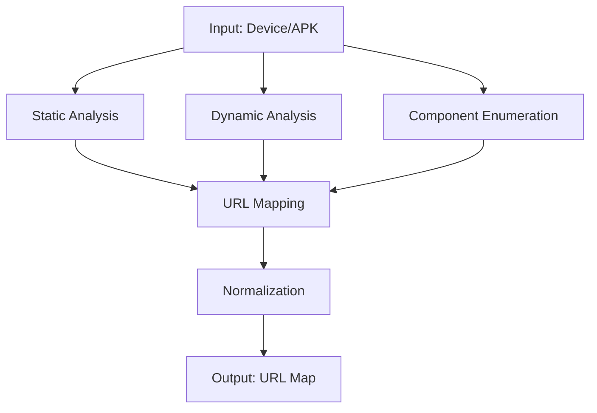

# Auto APK Analyzer


An automated APK analysis framework that discovers hidden mobile APIs through static extraction, dynamic interception, and enumeration completion techniques.

<p align="center">
  
</p>

## 📋 Table of Contents

- [Overview](#overview)
- [Key Features](#key-features)
- [Architecture](#architecture)
- [Prerequisites](#prerequisites)
- [Installation](#installation)
- [Quick Start](#quick-start)
- [Usage](#usage)
- [Output Format](#output-format)
- [Special Features](#special-features)
- [Testing](#testing)
- [Contributing](#contributing)
- [License](#license)

## Overview

This tool implements a comprehensive pipeline for analyzing Android applications (APKs) to discover APIs that are difficult to detect through traditional scanning methods. The system works on rooted test devices and combines multiple analysis techniques:

1. **Static Analysis**: Extracts URLs, endpoints, and secrets from APK files using JADX, APKLeaks, and MobSF
2. **Dynamic Interception**: Captures real API traffic using proxy tools with Frida-based certificate pinning bypass
3. **Component Enumeration**: Discovers exported components and content URIs using Drozer
4. **Active Enumeration**: Completes API coverage using advanced techniques
5. **AI-Assisted Discovery**: Leverages LLMs (Gemini, ChatGPT, Perplexity, ModelScope, OpenRouter) for enhanced app and API discovery
6. **Structured Workflows**: Predefined flows with task and subtask management for systematic analysis

## Key Features

- 🔍 **Automated scanning** of installed applications on rooted Android devices
- 🐦 **Special Flutter handling** with dedicated detection and interception
- 🧱 **Three-layer analysis approach**: static extraction → dynamic interception → enumeration completion
- 🗺️ **URL Map generation** with normalized endpoint information
- 🔐 **Certificate pinning bypass** using Frida scripts
- 📁 **Developer-based APK organization** for systematic analysis
- 🤖 **AI-assisted discovery** using multiple LLMs
- 🔄 **Structured workflow management** with predefined flows and tasks
- 🧪 **Complete testing framework** with unit and integration tests
- 📊 **Risk classification** and evidence tracking

## Architecture



The pipeline consists of several main modules:

1. **Device Management**: Enumerates apps on device and organizes them by developer
2. **Static Extraction Subsystem**: Uses JADX, APKLeaks, and MobSF to extract hardcoded URLs, endpoints, and secrets
3. **Dynamic Capture Module**: Employs proxy tools with Frida hooks for traffic interception and certificate pinning bypass
4. **Component Enumeration Module**: Uses Drozer to discover exported components and content URIs
5. **Flutter App Handler**: Specialized module for detecting and handling Flutter applications
6. **URL Mapping System**: Consolidates findings from all sources into a normalized URL Map
7. **AI-Assisted Discovery**: Integrates with LLMs for enhanced app and API discovery
8. **Task Management**: Structured workflows with task and subtask management
9. **Workspace Management**: Organizes analysis results by developer and app

## Prerequisites

- Rooted Android device or emulator
- ADB (Android Debug Bridge)
- Python 3.7+
- Required tools:
  - JADX: Installed via Homebrew or manually
  - APKLeaks: Installed via Homebrew
  - MobSF: Installed via pip
  - Frida: Installed via pip
  - Drozer: Installed via pip
  - Reqable: Needs to be installed separately (optional)
- For Flutter apps: Specialized Frida scripts for TLS bypass
- API keys for LLM services (optional but recommended)

## Installation

```bash
# Clone the repository
git clone <repository-url>
cd auto-apk-analyze

# Install Python dependencies
pip install -r requirements.txt

# Install analysis tools
brew install jadx apkleaks
pip install mobsf drozer frida-tools

# Install Frida server on your Android device
# Download from: https://github.com/frida/frida/releases

# Make the launcher executable
chmod +x auto_apk_analyzer
```

## Quick Start

```bash
# Analyze all third-party apps on connected device
./auto_apk_analyzer

# Analyze a specific APK file
./auto_apk_analyzer --input /path/to/app.apk

# Run predefined analysis flow
./auto_apk_analyzer --flow device_analysis
```

## Usage

### Device Analysis Mode (Default)
```bash
# Analyze all third-party apps on connected device and organize by developer
python3 src/main.py --mode device
```

### LLM Discovery Mode
```bash
# Discover apps and APIs using LLM services
python3 src/main.py --mode llm --query "mobile banking apps in Southeast Asia"
```

### Predefined Flow Execution
```bash
# Execute a predefined analysis flow
python3 src/main.py --flow device_analysis

# Available flows:
# - device_analysis: Complete analysis of APKs on connected Android device
# - file_analysis: Analysis of APK files provided as input
# - llm_discovery: Discovery of mobile apps and APIs using LLM services
# - full_analysis: Full static, dynamic, and AI-assisted analysis pipeline
```

### Static Analysis Mode
```bash
# Analyze a specific APK file
python3 src/main.py --input /path/to/app.apk --mode static
```

### Full Analysis Mode
```bash
# Perform complete analysis (static + dynamic)
python3 src/main.py --input /path/to/app.apk --mode full
```

## Output Format

The analysis generates a comprehensive URL Map including:

```json
{
  "metadata": {
    "generated_at": 1234567890.123,
    "total_entries": 42,
    "risk_distribution": {
      "LOW": 25,
      "MEDIUM": 12,
      "HIGH": 5
    }
  },
  "entries": [
    {
      "signature": "api.example.com/v1/users/{id}",
      "host": "api.example.com",
      "path": "/v1/users/{id}",
      "method": "GET",
      "parameters": [
        {
          "type": "numeric_id",
          "value": "123"
        }
      ],
      "sources": ["static", "dynamic"],
      "original_urls": [
        "https://api.example.com/v1/users/123",
        "https://api.example.com/v1/users/456"
      ],
      "risk_level": "MEDIUM",
      "first_seen": 1234567890.123,
      "last_seen": 1234567890.123,
      "frequency": 2
    }
  ],
  "domains": ["api.example.com", "cdn.example.com"],
  "endpoints": ["/api/v1/login", "/api/v1/register"]
}
```

## Special Features

### Special Flutter App Handling

The framework includes specialized handling for Flutter applications which use a different network stack:

- Detection of Flutter apps through assets/flutter_assets directory and libflutter.so
- Traffic routing via ProxyDroid/VPN/iptables
- TLS certificate validation bypass using Frida scripts
- Two approaches: reFlutter repackaging or runtime hooking
- Dedicated Frida scripts for BoringSSL function hooking
- Automatic configuration of proxy settings for Flutter apps

### LLM Integration

The tool can leverage multiple LLMs for enhanced discovery:
- **Perplexity**: For real-time information retrieval about apps and APIs
- **Gemini**: For advanced analysis and pattern recognition
- **ChatGPT**: For comprehensive app behavior understanding
- **ModelScope**: For access to Qwen models and other Chinese LLMs
- **OpenRouter**: For access to multiple models through a single API

API keys should be configured in `api_keys.json` to enable these features.

### Workflow Management

The tool includes a comprehensive task management system with:

#### Predefined Flows
1. **Device Analysis Flow**: Complete analysis of APKs on connected Android device
2. **File Analysis Flow**: Analysis of APK files provided as input
3. **LLM Discovery Flow**: Discovery of mobile apps and APIs using LLM services
4. **Full Analysis Flow**: Complete static, dynamic, and AI-assisted analysis pipeline

#### Task Hierarchy
Each flow contains multiple tasks, and complex tasks can have subtasks:
- Tasks have priorities (Low, Medium, High, Critical)
- Tasks can be in states (Pending, In Progress, Completed, Failed)
- Parent tasks automatically complete when all subtasks are completed
- Progress tracking and status reporting

## Testing

The project includes a comprehensive testing framework:
- Unit tests for all core modules
- Integration tests for module interactions
- Import verification tests
- Mock-based testing for external dependencies

Run all tests:
```bash
python3 tests/run_tests.py
```

Run specific test modules:
```bash
python3 -m unittest tests.test_static_analyzer
python3 -m unittest tests.test_dynamic_analyzer
```

## Contributing

Contributions are welcome! Here's how you can contribute:

1. Fork the repository
2. Create a feature branch (`git checkout -b feature/AmazingFeature`)
3. Commit your changes (`git commit -m 'Add some AmazingFeature'`)
4. Push to the branch (`git push origin feature/AmazingFeature`)
5. Open a Pull Request

Please ensure your code follows the existing style and includes appropriate tests.

## License

This project is licensed under the MIT License - see the [LICENSE](LICENSE) file for details.

## Acknowledgments

- Thanks to all contributors who have helped with testing and improvements
- Inspired by various mobile security research tools and frameworks
- Special thanks to the open-source community for the tools this project integrates with